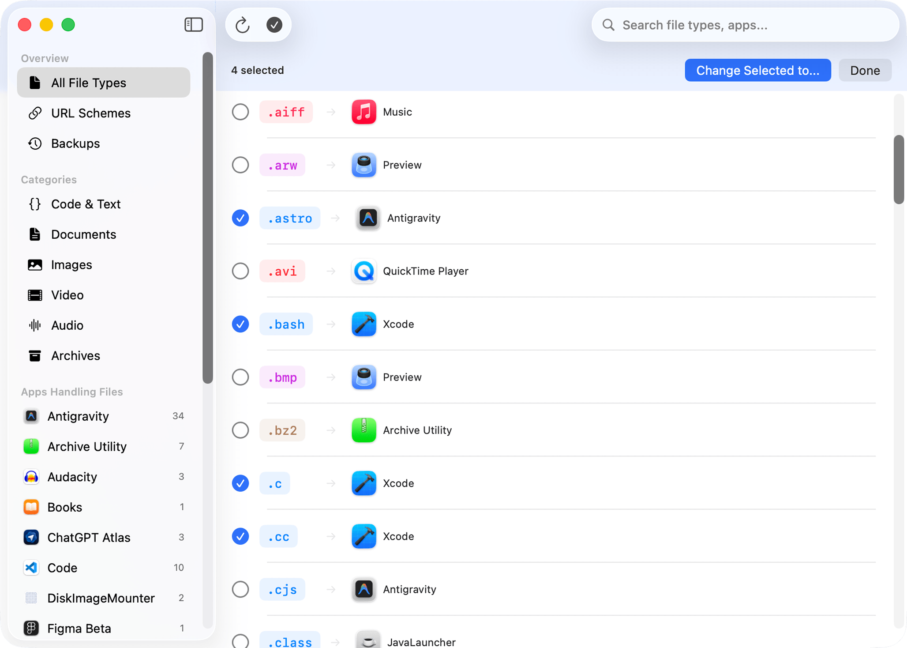

# Calculator++ (KMP + Compose + Material 3)

<p align="center">
  
</p>

<p align="center">
  <strong>Precision-first calculator workflows, rebuilt with Kotlin Multiplatform.</strong><br>
  A modern fork of the original Android Calculator++ with shared logic and UI across Android and iOS.
</p>

<p align="center">
  <a href="https://kotlinlang.org/"></a>
  <a href="https://www.jetbrains.com/lp/compose-multiplatform/"></a>
  <a href="#"></a>
  <a href="https://github.com/serso/android-calculatorpp"></a>
</p>

---

This repository is an active fork of [serso/android-calculatorpp](https://github.com/serso/android-calculatorpp), focused on a Compose-first user experience, a Kotlin Multiplatform architecture, and modern calculator workflows.

## Key Features

- Multi-tab calculator workspace with add/close, long-press reorder, and persisted tab state.
- Multiple calculator modes and workflows, including RPN mode and paper tape.
- Programmer-oriented controls: numeral base, bitwise word size, and signed/unsigned behavior.
- Formula library, graphing, converter, variables, and functions screens.
- Adaptive Compose layouts with foldable-aware behavior.
- Android home screen widgets (interactive calculator, quick calc, history, converter, smart stack).

## Screenshot

<p align="center">
  
</p>

## Tech Stack

- UI: [Compose Multiplatform](https://www.jetbrains.com/lp/compose-multiplatform/) with Material 3
- Architecture: Kotlin Multiplatform (shared domain, state, and UI)
- DI: [Koin](https://insert-koin.io/)
- Storage: [DataStore](https://developer.android.com/topic/libraries/architecture/datastore) (KMP) + [Room](https://developer.android.com/kotlin/multiplatform/room) (KMP)
- Navigation: [Navigation 3](https://developer.android.com/jetpack/compose/navigation)
- Concurrency: [Kotlinx Coroutines](https://github.com/Kotlin/kotlinx.coroutines)
- Serialization: [Kotlinx Serialization](https://github.com/Kotlin/kotlinx.serialization)
- Theming: [Material Kolor](https://github.com/jordond/MaterialKolor)
- Networking: [Ktor](https://ktor.io/)

## Project Structure

- `shared/`: core app logic, Compose screens, state handling, preferences, and data layer.
- `androidApp/`: Android entry point, manifest, platform integrations, and widget infrastructure.
- `iosApp/`: iOS host project consuming the shared module framework.
- `jscl/`: math engine and parser/evaluator internals.
- `dragbutton/`: gesture/button interaction module.
- `web/`: website/marketing assets and Next.js app.

Reference and legacy directories:

- `old-app/`, `reference-ui/`, `more-references-ui/` are useful for migration context but are not the primary app build path.

## Getting Started

### Prerequisites

- JDK 17+
- Android Studio (recent version with KMP/Compose support)
- Android SDK (`compileSdk 36`, `minSdk 26`)
- Xcode 15+ (for iOS development)

### Build and Run

Android debug APK:

```bash
./gradlew :androidApp:assembleDebug
```

Install on device/emulator:

```bash
./gradlew :androidApp:installDebug
```

Fast Kotlin compile check:

```bash
./gradlew :androidApp:compileDebugKotlin
```

iOS:

1. Open `iosApp/iosApp.xcodeproj` in Xcode.
2. Select a simulator/device.
3. Run the `iosApp` target.

Optional CLI helper for Xcode integration:

```bash
./gradlew :shared:embedAndSignAppleFrameworkForXcode
```

## Fork Workflow

Recommended remotes:

- `origin`: your fork (`bernaferrari/android-calculatorpp`)
- `upstream`: original repository (`serso/android-calculatorpp`)

Example setup:

```bash
git remote set-url origin git@github.com:bernaferrari/android-calculatorpp.git
git remote set-url upstream https://github.com/serso/android-calculatorpp.git
```

## Status

This fork is under active development and intentionally diverges from upstream in architecture and UX direction.
